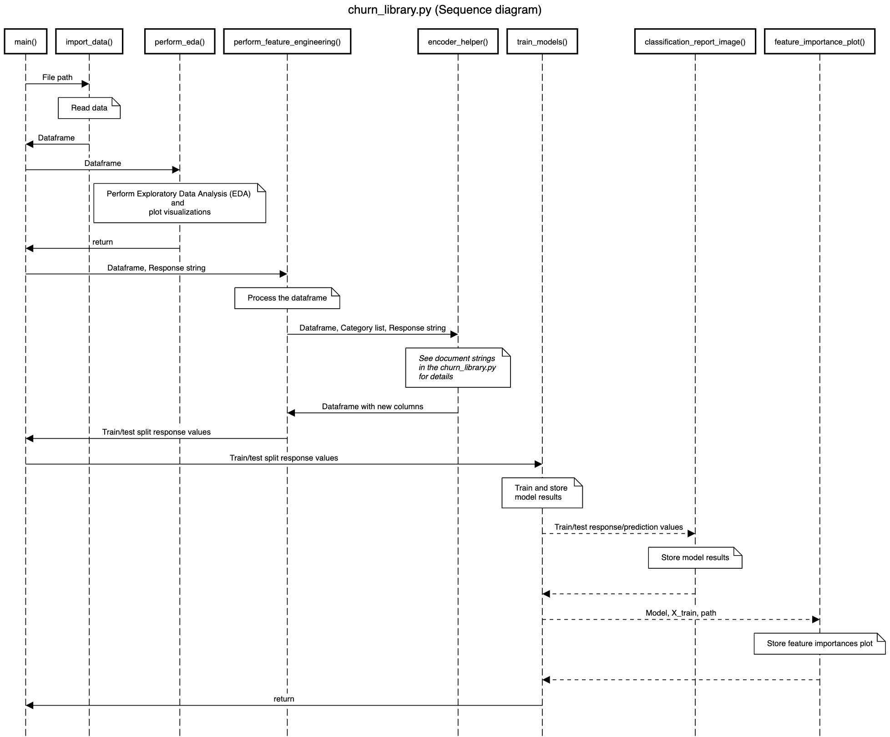

# Predict Customer Churn

Project **Predict Customer Churn** of ML DevOps Engineer Nanodegree Udacity.

## Project Description

This is a project to predict customer churn using [credit card data from Kaggle](https://www.kaggle.com/datasets/sakshigoyal7/credit-card-customers).
The data card describes the problem that this data set can help tackling as such:

> A manager at the bank is disturbed with more and more customers leaving their credit card services. They would really appreciate if one could predict for them who is gonna get churned so they can proactively go to the customer to provide them better services and turn customers' decisions in the opposite direction.

The focus of this project is to display clean code principles: writing code that is clean, modular, documented, follows style guidelines, and is tested.

## Files and data description

The main folders and files of the project are:

```
.
│   .gitignore
│   .pylintrc
│   churn_library.py
│   churn_script_logging_and_tests.py
│   conftest.py
│   README.md
│   requirements_py310.txt
├───data
│       bank_data.csv
│
├───images
│   │   sequencediagram.jpeg
│   │
│   ├───eda
│   │       churn_distribution.png
│   │       customer_age_distribution.png
│   │       heatmap.png
│   │       marital_status_distribution.png
│   │       total_trans_ct_distribution.png
│   │
│   └───results
│           LogisticRegression_results.png
│           LogisticRegression_shap_feature_importances.png
│           RandomForestClassifier_feature_importances.png
│           RandomForestClassifier_results.png
│           RandomForestClassifier_shap_feature_importances.png
│           ROC_LogisticRegression_RandomForestClassifier.png
│
├───logs
│       churn_library.log
│
├───models
│       LogisticRegression.pkl
│       RandomForestClassifier.pkl
│
├───notebooks
│       churn_notebook.ipynb
│       Guide.ipynb
│
└───src
        constants.py
        models.py
        plotting.py
        __init__.py

```

The most important folders are:

- `data`: contains the input data set with credit card data
- `images`: contains output plots for EDA and model evaluations
- `logs`: contains logs displaying info, warning, and error events when running the library and test suite
- `models`: contains trained models

The main modules to run are `churn_library.py` and `churn_script_logging_and_tests.py`.

The following diagram displays the main flow of `churn_library.py`:




## How to run

### Getting started

Clone this repository using the following command:

```
git clone https://github.com/EdwinWenink/customer_churn.git
```

### Installing dependencies

NOTE: This project requires Python 3.10.
You can create a new conda environment with Python 3.10 using:

```
conda create -n churn python=3.10
```

This project relies on the following packages:

```
scikit-learn
shap==0.41.0
joblib
pandas
numpy==1.23.0
matplotlib
seaborn
pylint
autopep8
```

You can install dependencies in your environment of choice using the requirements file for Python 3.10:

`pip install -r requirements_py310.txt`

NOTE: The `shap` package is not maintained well and currently only compatible with `numpy` <= 1.23.

### Running the churning pipeline

After installing the required dependencies, you can run the churning pipeline by calling the main module:

```
python churn_library.py
```

Or:

```
ipython churn_library.py
```

By default, the outputs of the pipeline will be visible both in the command line and under `logs\churn_library.log`.

### Testing and logging

If you specifically want to inspect test functions, you can invoke `pylint` as follows:

```
pylint churn_script_logging_and_tests.py
```

This testing script can also be invoked directly using `python` or `ipython`.
The testing results will also be logged under `logs\churn_library.log`.